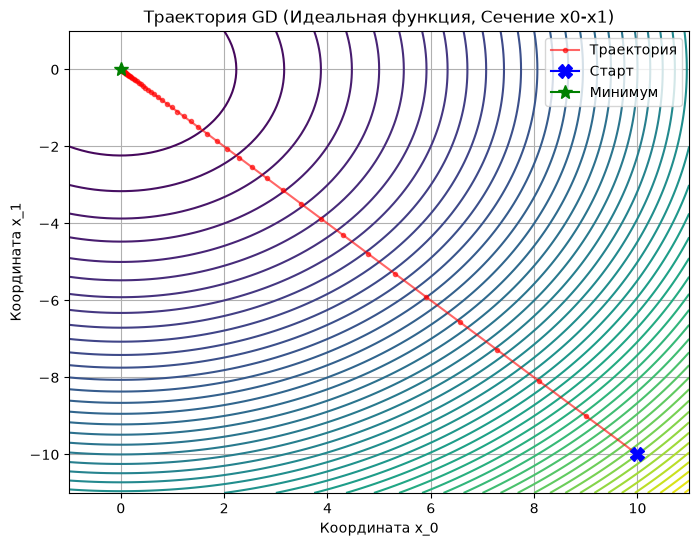
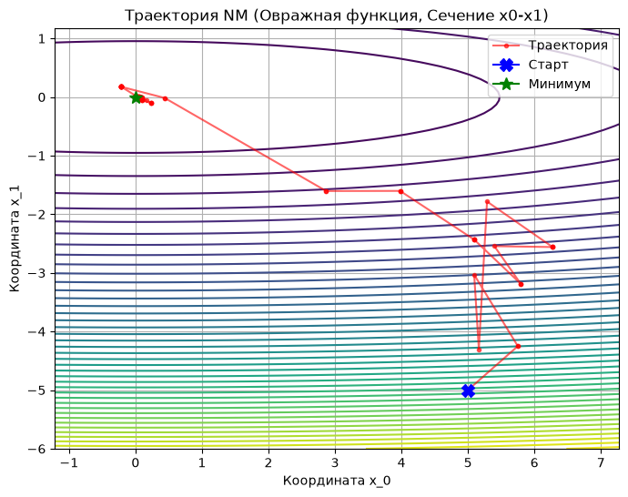
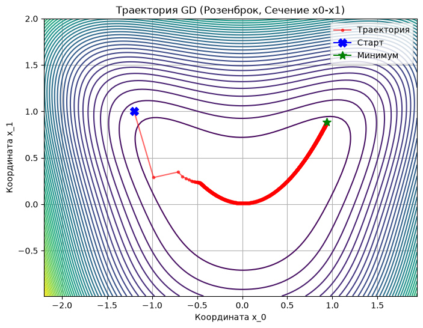
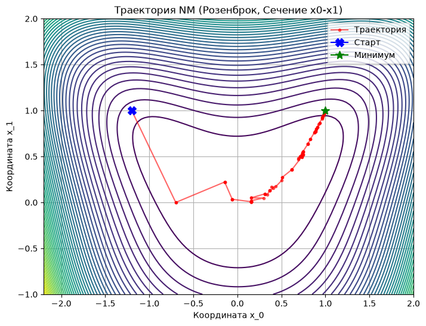
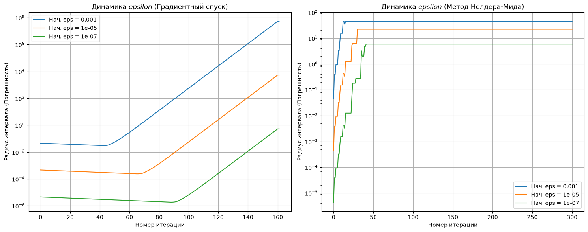
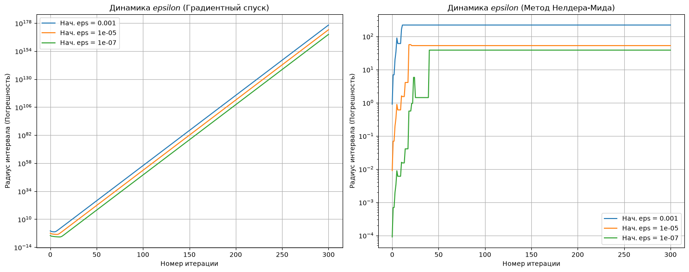
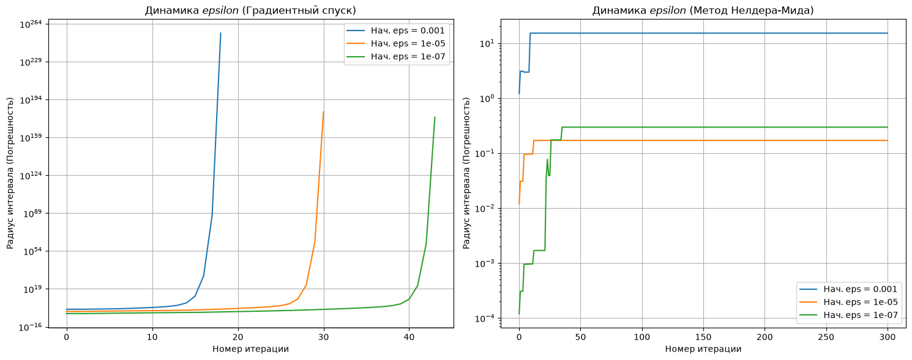

# Отчет по лабораторной работе №1: Продвинутые методы оптимизации

## 1. Цель работы
Главная задача лабораторной работы - реализовать пользовательский тип данных "Конструктивное число" (интервальная арифметика) и протестировать его влияние на работу алгоритмов численной оптимизации. В ходе работы необходимо было написать унифицированные целевые функции ("черные ящики"), реализовать методы оптимизации 0-го и 1-го порядка, а затем исследовать их сходимость и эффект "разбухания" погрешности ($\varepsilon$) на различных математических ландшафтах.

## 2. Теоретическая справка

Для успешного проведения экспериментов были использованы следующие математические концепции:

### Конструктивное число и интервальная арифметика
Конструктивное число представляет собой не точное скалярное значение, а интервал, внутри которого гарантированно находится истинное значение. 
* **Центр интервала** используется алгоритмами для принятия решений о направлении движения.
* **Радиус интервала ($\varepsilon$)** отражает текущую погрешность вычислений.
* **Проблема зависимости (Dependency Problem):** Базовая интервальная арифметика крайне пессимистична. При многократном использовании одной и той же переменной в формуле компьютер не понимает, что это связанные данные, и складывает погрешности так, будто они независимы. Это приводит к стремительному (часто экспоненциальному) разбуханию границ интервала при выполнении итеративных алгоритмов.

### Градиентный спуск (Метод 1-го порядка)
Градиентный спуск - это итерационный алгоритм первого порядка, использующий информацию о векторе первых производных (антиградиенте) для поиска локального минимума целевой функции.

**Математическая модель:**
На каждой итерации $k$ алгоритм вычисляет вектор градиента $\nabla f(x_k)$, который указывает направление наискорейшего возрастания функции. Чтобы найти минимум, алгоритм делает шаг в противоположном направлении (по антиградиенту).
Формула пересчета координат: 
$$x_{k+1} = x_k - \alpha \nabla f(x_k)$$
Где $\alpha$ - *learning rate* (скорость обучения), гиперпараметр, определяющий длину шага.

**Особенности поведения на различных ландшафтах:**
* **Идеальные функции ($\kappa \approx 1$):** Линии уровня имеют форму правильных сфер. Вектор антиградиента всегда направлен строго в центр оптимума, что обеспечивает быструю и прямую линейную сходимость без осцилляций.
* **Овражные функции ($\kappa \approx 100$):** Линии уровня вытянуты в форме эллипсов. На склонах такого "оврага" градиент направлен почти перпендикулярно дну. Алгоритм совершает огромные шаги от одной стенки оврага к другой (зигзаги), при этом продвижение вдоль дна к минимуму оказывается ничтожно малым.
* **Функция Розенброка:** Представляет собой узкую невыпуклую (изогнутую) долину. Градиентный спуск мгновенно скатывается на дно долины, но затем застревает, требуя тысяч итераций и вызовов производной из-за постоянных рикошетов от крутых стенок.

### Метод Нелдера-Мида (Метод 0-го порядка)
Метод Нелдера-Мида (или метод деформируемого многогранника) - это эвристический алгоритм безусловной оптимизации, который не использует информацию о производных. Алгоритм ориентируется исключительно на значения самой целевой функции.

**Алгоритм работы:**
В $N$-мерном пространстве алгоритм строит невырожденный симплекс - многогранник, состоящий из $N+1$ вершин. На каждой итерации алгоритм пытается заменить наихудшую вершину на новую, более оптимальную, последовательно применяя геометрические преобразования к симплексу:
1. **Сортировка:** Вершины сортируются по значению целевой функции от лучшей к худшей.
2. **Отражение (Reflection):** Худшая точка отражается относительно центра тяжести остальных точек. Если новая точка лучше старой, она принимается.
3. **Растяжение (Expansion):** Если отраженная точка оказалась новой лучшей точкой (мы нашли крутой склон, ведущий вниз), алгоритм делает еще один шаг в том же направлении, "растягивая" симплекс.
4. **Сжатие (Contraction):** Если отражение не принесло улучшений (мы уперлись в стенку), алгоритм сжимает симплекс, ища точку ближе к центру тяжести.
5. **Глобальное сжатие (Shrink):** Если ни одно действие не помогло, симплекс пропорционально стягивается ко всем координатам лучшей найденной точки.

**Особенности метода:**
В отличие от градиента, симплекс способен адаптироваться к топологии пространства. Попадая в овраг (как в функции Розенброка), многогранник сплющивается и вытягивается вдоль дна, что позволяет ему эффективно "скользить" к минимуму без осцилляций. Однако отсутствие производных означает, что на каждом шаге алгоритм вынужден вычислять саму целевую функцию от 2 до $N+2$ раз, что делает его вычислительно затратным на сложных ландшафтах.

## 3. Архитектура решения

Согласно требованиям к оформлению, логика алгоритмов полностью отделена от исследовательских ноутбуков. Ниже приведена краткая документация по ключевым модулям проекта.

### Конструктивное число
**Файл реализации:** [`src/constructive_number.py`](./src/constructive_number.py)

Пользовательский тип данных `ConstructiveNumber` реализует логику интервальной арифметики. Основная идея класса - позволить алгоритмам работать с диапазонами значений так же легко, как и с обычными числами `float`.

**Ключевые особенности реализации:**
* **Гибкая инициализация:** Объект можно создать как через передачу центра и радиуса погрешности (число $x$ и $\varepsilon$), так и через явное указание границ интервала $[a, b]$.
* **Нативная арифметика:** В классе перегружены базовые математические операторы (`__add__`, `__sub__`, `__mul__`, `__truediv__`, а также их `r`-версии для правосторонних операций). Они позволяют целевым функциям и оптимизаторам производить вычисления, даже не "зная", что на вход поступил интервал, а не обычное число.
* **Безопасность:** В методе деления (`__truediv__`) встроена защита от деления на ноль  если интервал-делитель содержит ноль, выбрасывается исключение `ZeroDivisionError`.
* **Утилитные методы:** Реализованы методы `get_center()` и `get_radius()` для извлечения скалярного центра интервала, который необходим для работы критериев остановки в алгоритмах,  и оценки текущей погрешности $\varepsilon$, которая используется для построения графиков разбухания. Перегружены операторы сравнения (`__lt__`, `__eq__`), которые производят логические проверки по центрам интервалов.

### Целевые функции
**Файл реализации:** [`src/black_box.py`](./src/black_box.py)

В данном модуле реализованы функции, которые выступают в роли математических ландшафтов для тестирования алгоритмов оптимизации.

**Ключевые особенности реализации:**
* **Унифицированный интерфейс (`BaseFunction`):** Создан абстрактный базовый класс, который обязывает все целевые функции иметь методы `__call__` (для вычисления значения функции в точке), `gradient` (для аналитического вычисления вектора первых производных) и `hessian` (для матрицы вторых производных). 
* **Встроенное профилирование:** Базовый класс содержит внутренние счетчики `f_calls`, `grad_calls` и `hessian_calls`, а также метод `reset_counters()` для их обнуления. Это архитектурное решение позволяет точно отслеживать вычислительную сложность (количество обращений к функции и производным) во время проведения экспериментов.
* **Совместимость с интервалами:** Внутри методов `__call__` намеренно не используются оптимизированные вычисления из сторонних библиотек (например, `numpy`). Все суммы и произведения прописаны через базовые операторы Python, чтобы интерпретатор гарантированно обращался к перегруженным магическим методам нашего класса `ConstructiveNumber`.

**Реализованные тестовые функции:**
1. `IdealQuadraticFunction`: 6-мерная квадратичная функция с идеальным числом обусловленности ($\kappa = 1$).
2. `BadConditionQuadraticFunction`: 4-мерная овражная квадратичная функция с плохой обусловленностью ($\kappa = 100$)
3. `RosenbrockFunction`: 3-мерная функция Розенброка - классический невыпуклый тест, на котором проверяется способность алгоритмов справляться с крутыми стенками и плоским изогнутым дном.

## 4. Результаты экспериментов

В данном разделе представлены ключевые метрики и графики, полученные в ходе тестирования алгоритмов. Полный код экспериментов и подробные логи доступны в ноутбуке [`research.ipynb`](./research.ipynb).

### 4.1. Тесты на вещественных числах

Алгоритмы первого (Градиентный спуск) и нулевого (Нелдер-Мид) порядка были протестированы на трех математических ландшафтах для оценки их эффективности и вычислительной сложности.

* **Идеальная квадратичная функция ($\kappa = 1$) - Градиентный спуск:**
  * **Сходимость и точность:** Метод успешно сошелся за 160 итераций, найдя оптимум $x^* \approx [0, 0, 0, 0, 0, 0]^T$ с машинной точностью (значение функции $0.0$).
  * **Траектория:** Строгая прямая линия от старта к оптимуму. Вектор антиградиента идеально направлен в центр, осцилляции полностью отсутствуют.
  * **Сложность:** Потребовалось 161 вызов градиента и 163 вызова функции.
  
  

* **Овражная квадратичная функция ($\kappa = 100$) - Метод Нелдера-Мида:**
  * **Сходимость и точность:** Алгоритм сошелся за 122 итерации. Точность немного уступает градиентному методу (финальное значение $f(x^*) \approx 6 \times 10^{-7}$), что типично для алгоритмов 0-го порядка на плоском дне.
  * **Траектория:** На старте симплекс "бьется" о крутые стенки оврага, совершая операции сжатия, которые вмдны как ступеньки на графике сходимости, после чего выстраивается вдоль пологого дна и делает длинный точный бросок к оптимуму.
  * **Сложность:** 825 вызовов функции и 0 вызовов градиента. Метод компенсирует отсутствие производных кратно большим числом вычислений функции.
  
  

* **Функция Розенброка (Сравнение алгоритмов):**
  * **Градиентный спуск:** Потерпел неудачу. Остановлен по лимиту (3000 итераций, 3001 вызов функции, 3000 вызовов градиента). Траектория показывает классическое застревание: алгоритм скатился на дно долины, но из-за плохой обусловленности начал совершать тысячи зигзагообразных микрошагов между стенками, так и не дойдя до минимума ($[1, 1, 1]$).
  * **Нелдер-Мид:** Успешно сошелся за 128 итераций (732 вызова функции). Гибкий симплекс плавно адаптировался к кривизне "банановидной" долины и просочился прямо в её центр без лишних метаний по стенкам.
  
  
  

### 4.2. Тесты с интервальной арифметикой

Для проверки устойчивости алгоритмов к погрешностям в данных, оптимизаторам передавались векторы из объектов `ConstructiveNumber` с тремя порядками начальной погрешности: $10^{-3}, 10^{-5}, 10^{-7}$. 

**1. Тест на Идеальной функции ($\kappa = 1$)**
* **Градиентный спуск (GD)**: Математически алгоритм сходится за 160 итераций (центры координат идеально приближаются к нулю), но из-за эффекта "разбухания" радиус ошибки взлетает в строгой геометрической прогрессии. При старте с $10^{-5}$ итоговый ответ выглядит как $0 \pm 42$.
* **Метод Нелдера-Мида (NM)**: Алгоритм полностью теряет устойчивость и останавливается по лимиту (300 итераций). Огромные перекрывающиеся интервалы искажают логику сравнения значений функции, из-за чего симплекс вырождается и просто застревает на месте.

**2. Тест на Овражной функции ($\kappa = 100$)**
* **Динамика Градиентного спуска**: Радиус неопределенности улетает до астрономических значений $\approx 10^{178}$. Зигзагообразные движения вектора антиградиента от стенки к стенке заставляют ошибку умножаться на огромные коэффициенты при каждом шаге, накапливаясь все 300 итераций.
* **Динамика Нелдера-Мида**: Симплекс быстро раздувается за счет операций отражения и растяжения на первых 30 шагах. Затем границы интервалов критически перекрываются, симплекс теряет ориентацию и выходит на мертвое плато, впустую расходуя оставшиеся итерации.

**3. Тест на функции Розенброка (Невыпуклая долина)**
* **Катастрофическое переполнение**: Наличие возведений в квадрат и агрессивных перемножений (например, $100(x_1 - x_0^2)^2$) ломает интервальную арифметику окончательно.
* **Динамика Градиентного спуска**: Демонстрирует суперэкспоненциальный взрыв. Поскольку в аналитическом градиенте присутствуют кубические члены, радиус разлетается до немыслимых $10^{264}$ всего за 20–40 шагов, после чего происходит аппаратное переполнение (`float overflow`), и вычисления обрываются.
* **Динамика Нелдера-Мида**: Симплекс "умирает" почти сразу. Сделав пару резких скачков, график выходит на бесконечное глухое плато - алгоритм не может отличить "лучшие" вершины от "худших" и бесконечно делает бесполезные стягивания в одной точке.

### 5. Общие выводы и личные размышления о влиянии начального $\varepsilon$

Когда я только планировал этот эксперимент мне казалось логичным, что если взять микроскопическую начальную погрешность (например, $10^{-7}$ вместо $10^{-3}$), то алгоритм получит "фору" и успеет сойтись к оптимуму до того, как интервалы критически разбухнут. 

Но, проанализировав логарифмические графики всех трех тестов, я увидел, что кривые для разных порядков $\varepsilon$ выстроились в абсолютно идеальные параллельные линии. На логарифмической шкале параллельность означает ровно одно - **относительный темп (множитель) роста ошибки абсолютно идентичен для любых стартовых значений**. 

Это стало хорошей иллюстрацией того, как на самом деле работает феномен зависимости . Я наглядно понял, что математическую природу разбухания невозможно обмануть простым повышением изначальной точности. Драйвер этого коллапса зашит не в самих входных числах, а исключительно **в архитектуре вычислений** - в том, в какой последовательности алгоритм складывает, вычитает и особенно перемножает переменные. 

Изучив вопрос (изначально я был уверен, что накосячил где-то в коде), я понял следующее: каждый алгебраический шаг внутри Градиентного спуска или метода Нелдера-Мида работает как мультипликатор. Интервальная арифметика не "помнит", что переменная $x$, используемая в формуле градиента трижды, - это один и тот же объект, и складывает её погрешность саму с собой так, будто это независимые случайные шумы.

В итоге я пришел к выводу, что уменьшение начального $\varepsilon$ - это лишь косметическая полумера. Да, аппаратное переполнение (`float overflow`) или вырождение симплекса наступит на 10–15 итераций позже, но агрессивность разбухания останется неизменной. Чтобы действительно решить эту проблему на сложных невыпуклых функциях, нужно менять не стартовые данные, а саму парадигму - например, усложнять структуру `ConstructiveNumber`, переходя к аффинной арифметике, которая способна отслеживать корреляции между переменными или к другим сособам.