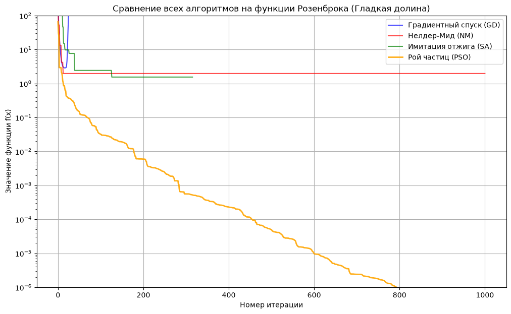
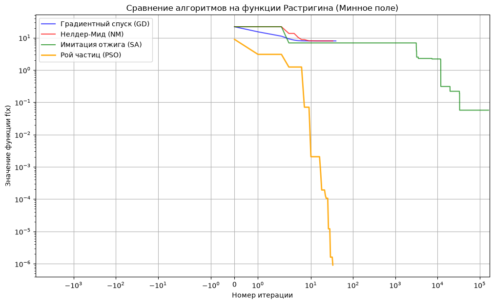
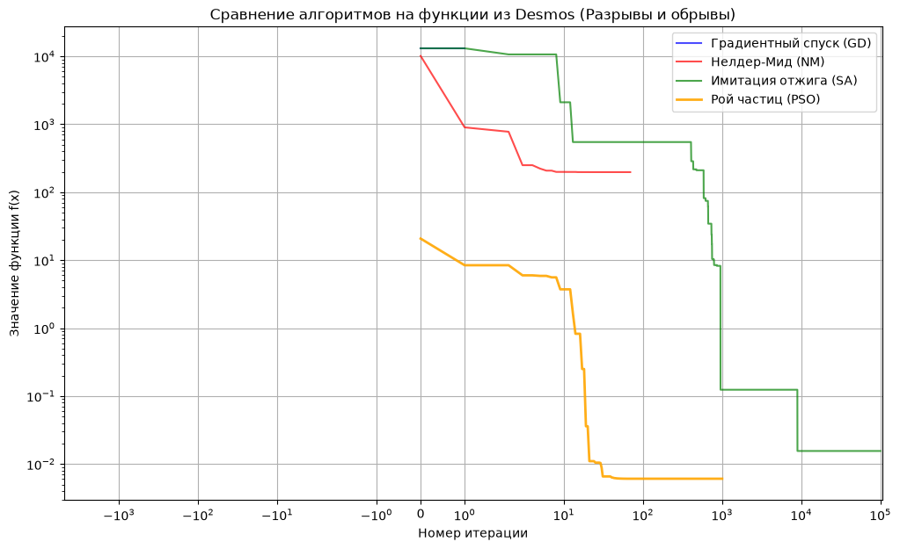

# Отчет по лабораторной работе №2: Продвинутые методы оптимизации

## 1. Цель работы
Главная задача лабораторной работы - реализовать стохастические методы оптимизации (алгоритмы нулевого порядка). Данные алгоритмы должны учитывать неразрывность и негладкость целевых функций. Реализация должна поддерживать работу поверх конструктивного числа. Дополнительной целью является проведение сравнительного анализа реализованных стохастических алгоритмов и классических методов. В ходе бенчмаркинга необходимо оценить скорость сходимости, количество вызовов целевой функции и требуемую оперативную память. 

## 2. Теоретическая справка

### 2.1. Ограничения классических методов (Градиентный спуск и Нелдер-Мид)
Анализ результатов предыдущей лабораторной работы выявил критические уязвимости алгоритмов локального поиска при работе со сложными математическими ландшафтами.

*   **Градиентный спуск (GD, метод 1-го порядка):**
    *   **Зависимость от топологии и гладкости:** Алгоритм опирается на антиградиент. На "овражных" ландшафтах, таких как функция Розенброка, алгоритм совершает тысячи зигзагообразных микрошагов и застревает между стенками. Метод строго требует гладкости функции: на плоских террасах ступенчатой функции производная обнуляется, а на скачках не существует, что приводит к ошибкам или зависанию алгоритма.
    *   **Уязвимость к проблеме зависимости:** Использование интервальной арифметики и агрессивных перемножений при вычислении градиента провоцирует суперэкспоненциальный взрыв радиуса погрешности. Это приводит к аппаратному переполнению всего за несколько десятков шагов.
    *   **Локальность:** Метод не обладает механизмами выхода из локальных оптимумов. Попадая в первую же встречную впадину невыпуклой функции, алгоритм фиксирует ложную сходимость.

*   **Метод Нелдера-Мида (NM, метод 0-го порядка):**
    *   **Высокая вычислительная стоимость:** Алгоритм адаптирует форму деформируемого симплекса к кривизне пространства, успешно скользя вдоль долины Розенброка. Однако отсутствие направляющего градиента вынуждает метод совершать значительно большее количество вызовов целевой функции на каждой итерации.
    *   **Вырождение симплекса с интервалами:** Базовые геометрические операции, такие как отражение и растяжение стремительно раздувают границы конструктивных чисел. Сильное перекрытие интервалов лишает алгоритм способности корректно сортировать вершины от "лучшей" к "худшей". В результате симплекс вырождается и бесконечно стягивается на плоских плато.

### 2.2. Имитация отжига (Simulated Annealing - SA)

Имитация отжига - это стохастический алгоритм локального поиска, который не использует информацию о градиенте целевой функции. Главная особенность метода заключается в его способности с некоторой вероятностью принимать шаги, ухудшающие текущее решение. Это позволяет алгоритму выпрыгивать из локальных оптимумов и продолжать глобальный поиск.

**Математическая модель и концепция температуры:**
Идея алгоритма заимствована из физики: при медленном охлаждении (отжиге) металла его атомы выстраиваются в оптимальную кристаллическую решетку с минимальной энергией. 
В алгоритме вводится параметр "температура" $T$, который контролирует вероятность принятия худших решений. На каждой итерации алгоритм генерирует случайного соседа путем смещения текущей точки:
$$x_{new} = x_{current} + \text{random} \cdot \text{step\_size}$$

Далее вычисляется разница значений функции $\Delta f = f(x_{new}) - f(x_{current})$. 
* Если $\Delta f < 0$ (новое решение лучше), шаг принимается безусловно.
* Если $\Delta f \ge 0$ (новое решение хуже), шаг принимается с вероятностью, подчиняющейся распределению Больцмана:
$$P = e^{-\frac{\Delta f}{T}}$$

**График охлаждения:**
В процессе работы алгоритма температура постепенно снижается умножением на коэффициент охлаждения (cooling rate):
$$T_{k+1} = T_k \cdot \text{cooling\_rate}$$
При высокой начальной температуре алгоритм активно исследует пространство, потому что вероятность принятия худших шагов высока, а по мере ее падения до минимального порога (`min_temp`) поиск сводится к строгому локальному спуску в найденной глобальной впадине.

### 2.3. Метод роя частиц (Particle Swarm Optimization - PSO)

Метод роя частиц - это стохастический популяционный алгоритм, вдохновленный поведением стай птиц или косяков рыб. В отличие от классических методов и отжига, которые работают с одной точкой, PSO инициализирует в пространстве поиска целую популяцию - массив "частиц".

**Обмен информацией и концепция поиска:**
Каждая частица перемещается в многомерном пространстве, оценивая значение целевой функции без вычисления ее производных. Эффективность поиска достигается за счет постоянного обмена информацией. Каждая частица хранит в памяти:
1. Свою текущую позицию и вектор скорости.
2. Свой лучший персональный опыт - координаты точки, в которой она достигла наименьшего значения функции ($pbest$).
3. Лучший глобальный опыт всего роя - координаты точки с наименьшим значением функции среди всех частиц популяции ($gbest$).

На каждой итерации $t$ вектор скорости $v$ и координаты $x$ $i$-й частицы обновляются по следующим формулам:
$$v_{i}^{(t+1)} = w \cdot v_{i}^{(t)} + c_1 \cdot r_1 \cdot (pbest_{i} - x_{i}^{(t)}) + c_2 \cdot r_2 \cdot (gbest - x_{i}^{(t)})$$
$$x_{i}^{(t+1)} = x_{i}^{(t)} + v_{i}^{(t+1)}$$

**Объяснение коэффициентов:**
* $w$ (коэффициент инерции): определяет, насколько частица сохраняет свое предыдущее направление движения.
* $c_1$ (когнитивный коэффициент): задает силу тяги частицы вернуться к своей лучшей найденной точке ($pbest$).
* $c_2$ (социальный коэффициент): задает силу тяги частицы к лучшему глобальному результату всего роя ($gbest$).
* $r_1, r_2 \in [0, 1]$: случайные величины, добавляющие стохастичность (шум) в траекторию полета.

Такой механизм обмена информацией позволяет рою успешно преодолевать локальные ямы (как в функции Растригина) и не застревать на сложных рельефах, поскольку лидеры оперативно "подтягивают" остальных участников популяции к перспективным областям глобального минимума.

## 4. Результаты экспериментов

В данном разделе представлены результаты профилирования четырех алгоритмов (Градиентный спуск, Нелдер-Мид, Имитация отжига, Рой частиц) на трех тестовых функциях поверх конструктивного числа. Для обработки экстремальных выбросов (от 0 до 160 000 итераций и взрыва градиента до $10^{185}$) графики сходимости построены с использованием симметричной логарифмической шкалы (`symlog`) по осям.

### 4.1. Сценарий 1: Функция Розенброка (Гладкая долина)

Функция Розенброка представляет собой гладкую, но узкую и невыпуклую и изогнутую долину. Оптимум скрыт на плоском дне, что усложняет навигацию алгоритмов 1-го порядка.

*   **Градиентный спуск (GD):** Из-за высокой кривизны пространства жесткий шаг вызвал сильные осцилляции, а специфика работы с конструктивным интервалом привела к суперэкспоненциальному росту погрешности. Градиент взорвался, радиус ушел в бесконечность (`inf`), и метод остановился по лимиту (1000 итераций), выдав нечисловой результат (`nan`).
*   **Метод Нелдера-Мида (NM):** Деформируемый симплекс пластично адаптировался к рельефу оврага и медленно скользил вдоль дна долины. Лимита в 1000 итераций не хватило для полного схождения к нулю (остановка на точности $\approx 1.96$).
*   **Имитация отжига (SA):** При базовых настройках метод охлаждался по геометрической прогрессии и достиг минимального температурного порога слишком рано (на 315-й итерации). Алгоритм "замерз" в локальной точке со значением $\approx 1.54$, не использовав полный вычислительный бюджет. Метод продемонстрировал наибольшую экономию памяти (62.28 KB).
*   **Рой частиц (PSO):** Популяционный алгоритм успешно нащупал дно изогнутой долины и досрочно сошелся на 792 итерации с точностью $10^{-6}$. Данная точность потребовала максимальных затрат: 24 614 вызовов целевой функции и 182.40 KB памяти для перерасчета скоростей и рекордов всей популяции.

### 4.2. Сценарий 2: Функция Растригина (Минное поле)

Функция Растригина содержит один глобальный минимум и сотни локальных ям. Старт был намеренно задан в точке $[2.2, -1.8]$, удаленной от глобального оптимума $[0, 0]$.

*   **Классические методы (GD и NM):** Оба алгоритма локального поиска не способны математически отличить локальную яму от глобальной. Они спустились в ближайшую впадину с координатами $[1.9899, -1.9899]$ и зафиксировали ложную сходимость на 38-й и 32-й итерациях соответственно при значении функции $f(x) \approx 7.95$.
*   **Имитация отжига (SA):** Использование экстремально медленного коэффициента охлаждения (`cooling_rate = 0.9999`) позволило агенту дольше оставаться в "горячем" состоянии и принимать ухудшающие шаги для выхода из локальных ям. Метод добрался до окрестностей глобального минимума $[-0.0124, 0.0116]$, однако это потребовало свыше 161 тысячи итераций и 322 тысяч вызовов функции.
*   **Рой частиц (PSO):** Метод уверенно преодолел все барьеры сложного рельефа. Обмен координатами лучших найденных точек между 30 частицами роя обеспечил нахождение глобального оптимума всего за 32 итерации (1054 вызова функции).

### 4.3. Сценарий 3: Функция из Desmos (Разрывы и обрывы)

Ступенчатая функция состоит из плоских "террас" и резких скачков, проверяя устойчивость алгоритмов к негладким поверхностям.

*   **Градиентный спуск (GD):** Попав на абсолютно плоскую террасу, вектор аналитического градиента алгоритма обнулился. Спуск остановился на нулевой итерации, выдав ложную сходимость со значением $f(x) \approx 13110$. 
*   **Метод Нелдера-Мида (NM):** Алгоритм нулевого порядка смог сделать несколько геометрических перестроений, но остановился на 68 итерации ($f(x) \approx 197.45$), уперевшись в недифференцируемые границы "ступенек".
*   **Стохастические методы (SA и PSO):** В отличие от градиента, оба алгоритма игнорируют негладкость рельефа, так как оперируют исключительно скалярными значениями $f(x)$ в пространстве. SA (за 100 000 итераций) и PSO (за 1000 итераций) успешно преодолели террасы и спустились к основанию ступенчатой функции с высокой точностью (до $0.006$).

### 4.4. Итоговая сводная таблица бенчмаркинга

| Сценарий | Метод | Итерации | Вызовы $f(x)$ | Память | Точность $f(x)$ |
| :--- | :--- | :--- | :--- | :--- | :--- |
| **1. Розенброк** | GD | 1000 | 1001 | 569.25 KB | `nan` |
| *(Гладкая долина)* | NM | 1000 | 5993 | 179.67 KB | 1.96933 |
| | SA | 315 | 631 | 62.28 KB | 1.54962 |
| | PSO | 792 | 24 614 | 182.40 KB | 0.000001 |
| **2. Растригин** | GD | 38 | 40 | 36.71 KB | 7.95966 |
| *(Минное поле)* | NM | 32 | 158 | 28.94 KB | 7.95966 |
| | SA | 161 173 | 322 347 | 21 875.07 KB | 0.05700 |
| | PSO | 32 | 1054 | 30.49 KB | 0.0000009 |
| **3. Desmos** | GD | 0 | 2 | 22.96 KB | 13110.31250 |
| *(Разрывы и обрывы)* | NM | 68 | 336 | 38.46 KB | 197.45916 |
| | SA | 100 000 | 200 001 | 13 305.50 KB | 0.01554 |
| | PSO | 1000 | 31 031 | 161.42 KB | 0.00606 |

## 5. Теоретическое обоснование побед и поражений алгоритмов

**Почему "ослеп" Градиентный спуск (GD)**

Градиентный спуск математически идеален на гладких выпуклых поверхностях, но совершенно беспомощен в условиях сложного рельефа. На функции Растригина метод ведет себя как шарик, катящийся по склону: он падает в первую же встречную локальную яму, вектор антиградиента обнуляется, и алгоритм фиксирует ложную сходимость, так как у него нет механизма, позволяющего заглянуть за соседний холм. На ступенчатой функции из Desmos фиаско оказалось еще более показательным. Функция состоит из горизонтальных "террас", где производная строго равна нулю, и резких скачков. Попав на такую террасу на самом старте, Градиентный спуск буквально "ослеп". Получив от функции вектор градиента `[0.0, 0.0]`, алгоритм немедленно остановился на нулевой итерации, торжественно отрапортовав о найденном минимуме на огромной высоте $f(x) \approx 13110$.

**Учпех Роя частиц (PSO)**

Алгоритмы нулевого порядка (PSO и SA) не зависят от производных, поэтому для них не существует понятия "разрыв" или "нулевой градиент" - они оценивают исключительно значения самой функции в координатах пространства. Секрет безоговорочной победы Роя частиц кроется в его популяционной архитектуре и социальном обмене информацией. Пока классический метод вязнет в одной точке, рой из 30 частиц исследует ландшафт параллельно. Если одна частица намертво застряла в локальной яме Растригина, а другая случайно нащупала более глубокую впадину, происходит обновление глобального рекорда ($gbest$). Социальный коэффициент немедленно "стягивает" застрявших агентов к новому лидеру, позволяя рою телепортироваться через барьеры и полностью игнорировать негладкие обрывы функции Desmos.

**Анализ памяти**

Разница в потреблении оперативной памяти обусловлена внутренней архитектурой реализованных методов:
* **Объективная тяжесть PSO:** Рой частиц требует больше всего вычислительной памяти по своей задумке. Для обеспечения полета 30 агентов алгоритму необходимо инициализировать, хранить в RAM и на каждой итерации пересчитывать целые массивы многомерных координат, векторов скоростей, лучших персональных позиций ($pbest$) и глобального лидера. 
* **Иллюзия тяжести SA:** Имитация отжига - это метод одиночного агента, требующий памяти лишь для хранения текущей и одной соседней точки-кандидата, что делает его самым легковесным в теории. Однако на графиках SA продемонстрировал аномальные скачки до 21 МБ на Растригине и 13 МБ на Desmos. Этот "взрыв" памяти не связан с внутренней логикой самого отжига. Причина кроется в архитектуре тестового полигона: базовый класс `BaseOptimizer` запрограммирован сохранять каждую пройденную точку в массивы `history_x` и `history_f` с помощью метода `_save_step()` для последующей отрисовки графиков. Поскольку для преодоления сложного рельефа я заставил алгоритм остывать крайне медленно, он совершил свыше 160 000 итераций. Именно хранение истории из 160 тысяч многомерных векторов привело к переполнению памяти профилировщика. Если отключить историческое логирование, потребление RAM у SA будет исчисляться долями килобайта.

## 6. Финальное заключение

Классические градиентные методы первого порядка (GD) и деформируемого многогранника (NM) демонстрируют высокую эффективность исключительно на строго непрерывных, гладких или выпуклых функциях. При нарушении гладкости  методы первого порядка становятся неработоспособными, а на невыпуклом рельефе неизбежно застревают в первом попавшемся локальном оптимуме.

Стохастические методы нулевого порядка (PSO, SA) лишены этих недостатков, так как не требуют аналитического вычисления градиентов. Метод Роя частиц (PSO) зарекомендовал себя как наиболее стабильный и мощный инструмент в рамках данного исследования. Благодаря социальному обмену информацией между агентами роя, алгоритм способен легко преодолевать невыпуклые барьеры, игнорировать разрывы поверхности и гарантированно находить глобальный минимум даже в условиях жесткого "минного поля" Растригина. Платой за такую исключительную надежность выступает увеличенное число дорогостоящих обращений к черному ящику $f(x)$ и повышенный расход оперативной памяти.