# 1. Введение и постановка задачи

## 1.1 Цель работы и формулировка задач
Цель работы - исследование характеристик дискретных и непрерывных временных рядов, программная реализация базовых и адаптивных алгоритмов цифровой фильтрации, а также сравнительный анализ их эффективности при подавлении шума на экономических данных и показаниях физических сенсоров.

Для достижения поставленной цели решаются следующие задачи:
* Разработать модульную библиотеку алгоритмов фильтрации на языке Python, включающую экспоненциальное сглаживание (EMA), одномерный фильтр Калмана, фильтр Савицкого-Голея и адаптивный фильтр LMS (нормализованный МНК).
* Выполнить исследовательский анализ данных (EDA) временного ряда продаж: рассчитать базовые статистики, оценить влияние отдельных товарных позиций на прибыль с помощью корреляционного анализа и выявить скрытые ритмы через автокорреляционную функцию (ACF).
* Провести серию вычислительных экспериментов на данных продаж своего варианта, подобрать параметры методов и сопоставить алгоритмы по метрикам MSE, MAE, коэффициенту сглаживания Smoothness Ratio и корреляции с исходным сигналом.
* Выполнить экспериментальное исследование на реальных данных двухканального инерциального датчика (акселерометра): отфильтровать аппаратный шум измерений и восстановить непрерывную траекторию движения на фазовой плоскости.

## 1.2 Исходные данные и расчет варианта
Номер студенческого билета (ИСУ): **471882**.

Выбор варианта данных осуществляется по формуле суммы цифр номера ИСУ по модулю 60:
$$\text{Вариант} = \left(\sum \text{цифр ИСУ}\right) \bmod 60 = (4 + 7 + 1 + 8 + 8 + 2) \bmod 60 = 30 \bmod 60 = 30$$

Для проведения основного исследования используется файл `sell.csv`, содержащий ежедневные наблюдения за 50 последовательных дней по 60 вариантам распределения продаж. Варианту 30 соответствует блок из 6 столбцов (индексы колонок со 175 по 180):
* Количественные показатели продаж: "мыло" (шт.), "порошок" (шт.), "средство" (шт.), "краска" (шт.), "пена" (шт.).
* Результирующий финансовый показатель: "прибыль" (тыс. руб.).

Файл имеет многоуровневый заголовок с метаданными, использует разделитель ";" и десятичные запятые в числах. Чтение данных реализовано через прямое вычисление смещения столбцов целевого варианта, что исключает зависимость логики от кодировки текстовых заголовков таблицы.

# 2. Теоретические основы и реализация алгоритмов (Задача 1)

Все алгоритмы фильтрации я реализовал в виде отдельных классов в модуле `src/filters.py`. Чтобы код был единообразным и соответствовал принципам ООП, все они наследуются от абстрактного базового класса `BaseFilter` и реализуют общий метод `.apply(data)`. Это позволяет вызывать любой фильтр через одинаковый интерфейс и легко прогонять их по данным в едином цикле.

## 2.1 Экспоненциальное сглаживание (EMA)
Экспоненциальное сглаживание - это базовый рекуррентный фильтр первого порядка. Его суть в том, что более свежим наблюдениям придается больший вес, а влияние старых точек постепенно затухает по геометрической прогрессии.

Математическая модель описывается рекуррентной формулой:
$$s_t = \alpha x_t + (1 - \alpha) s_{t-1}$$
где:
* $x_t$ - фактическое наблюдение в момент времени $t$;
* $s_t$ - сглаженное значение в момент времени $t$;
* $s_{t-1}$ - сглаженное значение с предыдущего шага;
* $\alpha \in (0, 1]$ - коэффициент сглаживания (темп затухания).

В качестве начального условия $s_0$ берется первое измерение ряда: $s_0 = x_0$.

Если раскрыть рекурсию на несколько шагов назад, то видно, как формируется итоговая оценка:
$$s_t = \alpha x_t + \alpha(1 - \alpha) x_{t-1} + \alpha(1 - \alpha)^2 x_{t-2} + \dots + (1 - \alpha)^t s_0$$
Веса при прошлых отсчетах уменьшаются по экспоненциальному закону. 

**Физический смысл коэффициента $\alpha$:**
Параметр $\alpha$ задает баланс доверия между сегодняшним измерением и всей накопленной историей:
* При $\alpha \to 1$ фильтр практически полностью доверяет текущей точке $x_t$. Сглаживание пропадает, и выходной сигнал начинает повторять весь высокочастотный шум.
* При $\alpha \to 0$ фильтр почти игнорирует новые измерения, опираясь только на прошлую оценку $s_{t-1}$. Траектория становится очень гладкой, но появляется сильный фазовый лаг (запаздывание), из-за чего алгоритм перестает вовремя реагировать на реальные изменения тренда.

Главное практическое достоинство EMA - вычислительная простота. Для работы алгоритма не нужно хранить в оперативной памяти скользящее окно из прошлых отсчетов, достаточно помнить всего одно предыдущее число $s_{t-1}$.

## 2.2 Одномерный фильтр Калмана (1D Kalman Filter)
Фильтр Калмана - это оптимальный рекуррентный байесовский алгоритм для оценивания истинного состояния динамической системы в условиях случайного гауссовского шума.

Для одномерного ряда продаж я использовал модель случайного блуждания (Random Walk) в пространстве состояний. Она описывается двумя уравнениями:
1. **Уравнение состояния (процесса):**
   $$x_t = x_{t-1} + w_t, \quad w_t \sim \mathcal{N}(0, Q)$$
   Мы предполагаем, что на очередном шаге истинное значение $x_t$ в среднем сохраняется на уровне предыдущего шага $x_{t-1}$, но испытывает случайное физическое возмущение $w_t$ с дисперсией процесса $Q$.
2. **Уравнение измерений (наблюдений):**
   $$z_t = x_t + v_t, \quad v_t \sim \mathcal{N}(0, R)$$
   Датчик или система учета измеряет величину $z_t$, которая складывается из истинного состояния $x_t$ и случайной ошибки наблюдений $v_t$ с дисперсией $R$.

Алгоритм работает циклически, повторяя на каждом шаге две фазы.

### Фаза 1. Прогноз (Time Update)
До получения нового измерения мы экстраполируем предыдущее состояние и оцениваем, насколько выросла наша неопределенность:
* Прогноз состояния:
  $$\hat{x}_{t|t-1} = \hat{x}_{t-1}$$
* Прогноз дисперсии ошибки:
  $$P_{t|t-1} = P_{t-1} + Q$$
Поскольку среда нестабильна, неопределенность нашего знания возрастает на величину дисперсии шума процесса $Q$.

### Фаза 2. Коррекция (Measurement Update)
В систему поступает реальное измерение $z_t$. Фильтр вычисляет оптимальный весовой коэффициент и корректирует оценку:
* Вычисление коэффициента Калмана (Kalman Gain):
  $$K_t = \frac{P_{t|t-1}}{P_{t|t-1} + R}$$
* Коррекция оценки состояния:
  $$\hat{x}_t = \hat{x}_{t|t-1} + K_t (z_t - \hat{x}_{t|t-1})$$
* Обновление дисперсии ошибки:
  $$P_t = (1 - K_t) P_{t|t-1}$$

**Физический смысл баланса шумов $Q$ и $R$:**
Коэффициент Калмана $K_t \in [0, 1]$ работает как адаптивный арбитр между нашими теоретическими ожиданиями и показаниями датчика:
* $Q$ (Process Noise) отражает, насколько быстро может меняться сам физический процесс. Большое значение $Q$ означает, что ряд крайне волатилен.
* $R$ (Measurement Noise) отражает величину шума и погрешности измерений.
* Если $R \gg Q$ (измерения сильно зашумлены), то $K_t \to 0$. Фильтр почти полностью игнорирует текущую точку $z_t$, опираясь на внутренний прогноз, что дает сильное сглаживание.
* Если $Q \gg R$ (система может резко прыгать, а прибор точный), то $K_t \to 1$. Фильтр моментально перестраивается под каждое новое измерение.

В отличие от EMA, где весовой коэффициент $\alpha$ жестко задан разработчиком на весь период, фильтр Калмана в процессе работы автоматически пересчитывает $K_t$ через дисперсию ошибки $P_t$, пока тот не выйдет на оптимальный стационарный режим.

## 2.3 Фильтр Савицкого-Голея
Фильтр Савицкого-Голея - это метод сглаживания данных на основе локальной полиномиальной регрессии по методу наименьших квадратов (МНК).

Если классическое скользящее среднее просто заменяет центральную точку окна константой (средним арифметическим), то Савицкий-Голей аппроксимирует точки внутри скользящего окна гладкой кривой - полиномом заданной степени:
$$p(k) = \sum_{j=0}^{d} c_j k^j$$
где:
* $w = 2m + 1$ - нечетный размер скользящего окна;
* $k \in [-m, m]$ - относительные координаты точек внутри текущего окна;
* $d$ - степень аппроксимирующего полинома (обычно $d = 2$ или $d = 3$);
* $c_j$ - коэффициенты полинома, которые ищутся через минимизацию суммы квадратов ошибок:
$$\sum_{k=-m}^{m} \left( x_{t+k} - p(k) \right)^2 \to \min$$

Сглаженным значением в момент времени $t$ объявляется значение построенного полинома в центральной точке окна, то есть при $k = 0$:
$$s_t = p(0) = c_0$$

Поскольку задача МНК для фиксированного размера окна и фиксированной степени полинома решается аналитически один раз, на практике фильтр сводится к быстрой дискретной свертке входного ряда с заранее рассчитанным весовым вектором.

**Главное достоинство метода:**
Обычные фильтры низких частот и скользящие средние сильно срезают резкие пики и сглаживают провалы, искусственно занижая амплитуду полезного сигнала. Фильтр Савицкого-Голея за счет локальной полиномиальной кривизны сохраняет форму, высоту, ширину и положение локальных экстремумов (пиковых всплесков спроса), эффективно отсекая лишь высокочастотное дрожание.

## 2.4 Адаптивный фильтр LMS (Нормализованный МНК)
Фильтр LMS (Least Mean Squares) - это адаптивный алгоритм, веса которого настраиваются непосредственно в процессе обработки сигнала с помощью стохастического градиентного спуска (SGD).

Для решения задачи фильтрации ряда я реализовал LMS в режиме адаптивного линейного предиктора порядка $p$. Идея заключается в следующем: система пытается спрогнозировать текущее значение ряда $x_t$, используя линейную комбинацию $p$ предыдущих наблюдений:
$$\hat{x}_t = \mathbf{w}_t^T \mathbf{x}_{t-1} = \sum_{i=1}^{p} w_{t, i} \cdot x_{t-i}$$
где $\mathbf{w}_t = [w_{t,1}, w_{t,2}, \dots, w_{t,p}]^T$ - вектор весовых коэффициентов фильтра на шаге $t$.

Далее рассчитывается ошибка предсказания:
$$e_t = x_t - \hat{x}_t$$

Чтобы фильтр обучался, веса обновляются по антиградиенту квадрата ошибки. Для численной стабильности я применил нормализованный алгоритм NLMS (Normalized LMS), в котором шаг обучения нормируется на квадрат евклидовой нормы вектора входных данных:
$$\mathbf{w}_{t+1} = \mathbf{w}_t + \frac{\mu}{\|\mathbf{x}_{t-1}\|^2 + \varepsilon} e_t \mathbf{x}_{t-1}$$
где:
* $\mu$ - темп обучения (learning rate);
* $\varepsilon = 10^{-4}$ - регуляризатор, защищающий от деления на ноль при околонулевой энергии входного вектора.

**Устранение смещения через центрирование ряда:**
Ряд прибыли в нашем датасете колеблется около среднего уровня 27 тыс. рублей. Если подать такой ряд на вход классического LMS с нулевой инициализацией весов, алгоритм потратит первые 15–20 шагов только на то, чтобы набрать постоянное смещение (bias). На выборке всего из 50 точек это привело бы к потере трети данных. 

Чтобы решить эту проблему, перед запуском фильтрации я вычисляю базовое смещение ряда по начальным отсчетам, центрирую ряд (вычитаю среднее), прогоняю адаптивный предиктор по флуктуациям вокруг нуля и затем возвращаю смещение обратно. Это обеспечивает моментальную сходимость с первых же шагов.

**Динамика адаптации весов:**
Полезный сигнал во временном ряде обладает внутренней корреляцией во времени, а случайный шум некоррелирован. Градиентный спуск постепенно подстраивает веса $\mathbf{w}$ только под регулярную составляющую ряда. Случайный шум отсеивается как непредсказуемая ошибка $e_t$, а выход предиктора $\hat{x}_t$ формирует очищенную от шума траекторию.

## 2.5 Ссылки на реализацию
Вся программная часть вынесена из блокнота в модули исходного кода в соответствии с регламентом лабораторных работ:
* [src/filters.py](./src/filters.py) - реализация абстрактного класса `BaseFilter` и дочерних классов `ExponentialSmoothing`, `KalmanFilter1D`, `SavitzkyGolayFilter`, `LMSFilter`.
* [src/utils.py](./src/utils.py) - функции загрузки данных варианта `load_variant_data`, фиксации случайного состояния `seed_everything`, расчета метрик качества `compute_metrics` и автокорреляции `compute_autocorrelation`.

# 3. Исследовательский анализ данных продаж (Задача 3)

Перед запуском алгоритмов фильтрации я исследовал структуру и статистические свойства временного ряда Варианта 30 из файла `sell.csv`. Это необходимо, чтобы понять природу данных: есть ли в них долгосрочный тренд, насколько они зашумлены и присутствуют ли скрытые периодические циклы.

## 3.1 Описательные статистики целевого ряда
Целевым показателем является столбец `прибыль`, измеряемый в тысячах рублей. Ряд содержит 50 ежедневных наблюдений ($N = 50$). 

Основные числовые характеристики ряда:
* Количество наблюдений: $50$
* Среднее значение ($\mu$): $27.04$ тыс. руб.
* Медиана: $27.24$ тыс. руб.
* Стандартное отклонение ($\sigma$): $1.71$ тыс. руб.
* Минимальное значение: $23.36$ тыс. руб. (день 20)
* Максимальное значение: $31.42$ тыс. руб. (день 17)
* Размах вариации: $8.06$ тыс. руб.

**Проверка стационарности и наличия тренда:**
Близость среднего значения ($27.04$) и медианы ($27.24$) указывает на симметричность распределения значений прибыли без тяжелых односторонних хвостов. 

Корреляция прибыли с переменной времени (`day`) составляет всего $-0.126$. Это говорит о том, что глобальный линейный тренд отсутствует: прибыль не растет и не падает на протяжении рассматриваемых 50 дней, а колеблется вокруг постоянного горизонтального уровня $27.04$ тыс. руб. Ряд является стационарным по математическому ожиданию и дисперсии. 

При этом размах колебаний превышает $8$ тыс. рублей (около 30% от среднего уровня), что свидетельствует о высокой дневной волатильности и подтверждает необходимость фильтрации случайных шумовых выбросов.

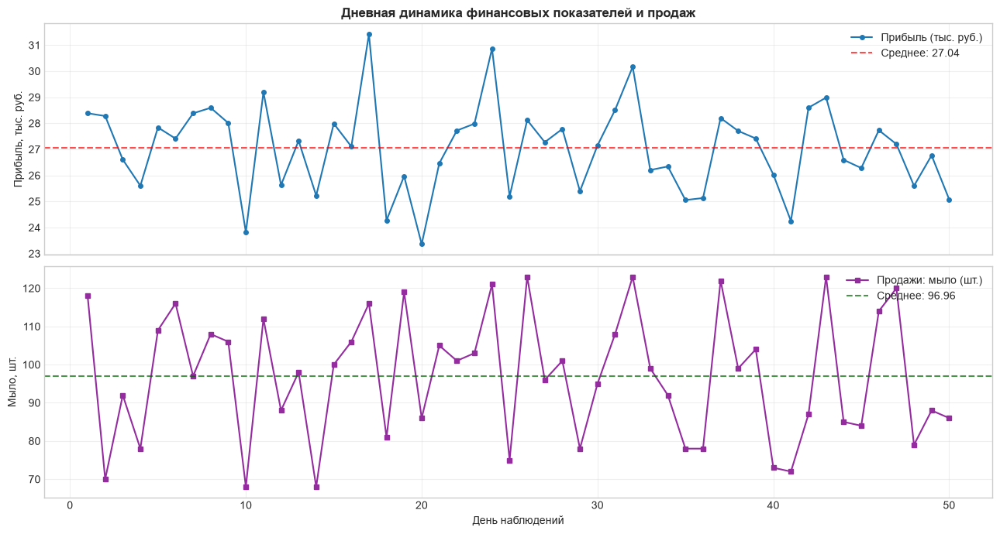
*Рисунок 1. Дневная динамика прибыли и объемов продаж ключевого товара (мыло) за 50 дней наблюдений*

## 3.2 Корреляционный анализ факторов прибыли
Чтобы определить, какие товарные категории формируют финансовый результат магазина, я рассчитал матрицу парных коэффициентов корреляции Пирсона между продажами всех пяти товаров и итоговой прибылью:

| Товарная позиция | Коэффициент корреляции с прибылью ($r$) |
| :--- | :--- |
| **мыло** | **+0.729** |
| **средство** | **+0.415** |
| порошок | +0.225 |
| пена | +0.221 |
| краска | +0.158 |

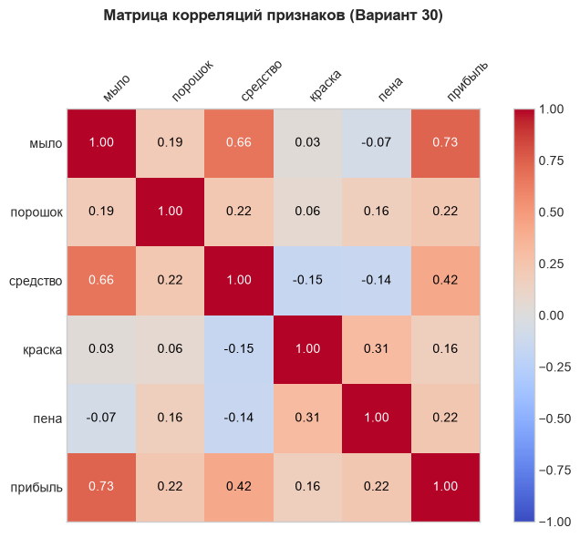
*Рисунок 2. Тепловая карта парных корреляций Пирсона между продажами товаров и прибылью (Вариант 30)*

**Интерпретация взаимосвязей:**
1. **Мыло - ключевой драйвер прибыли ($r = 0.729$).** Это самая сильная связь в наборе данных. График объемов продаж мыла практически синхронно повторяет пики и спады графика прибыли. Высокая маржинальность или преобладающий объем продаж этой категории делают ее определяющей для дневной выручки.
2. **Средство - сопутствующий фактор ($r = 0.415$).** Продажи чистящего средства вносят умеренный положительный вклад в прибыль. При этом между продажами мыла и средства наблюдается выраженная внутренняя коллинеарность ($r = 0.660$), что указывает на частые совместные покупки этих двух позиций покупателями (эффект сопутствующей корзины).
3. **Остальные товары (порошок, пена, краска).** Корреляция этих позиций с прибылью слабая ($r \in [0.158, 0.225]$). Их продажи носят случайный характер и практически не определяют суммарный финансовый результат дня.

## 3.3 Анализ автокорреляционной функции (ACF) и периодичности
Для выявления скрытых ритмов спроса я рассчитал автокорреляционную функцию (ACF) ряда прибыли на глубину до 20 лагов со стандартным доверительным интервалом 95% для белого шума:
$$\text{CI} = \pm \frac{1.96}{\sqrt{N}} = \pm \frac{1.96}{\sqrt{50}} \approx \pm 0.277$$

Значения коэффициентов автокорреляции для ключевых лагов:
* **Лаг 1 ($r_1 = -0.084$):** Автокорреляция первого порядка практически нулевая и лежит внутри доверительного коридора. Это означает, что ряд не обладает плавной однодневной инерцией: вчерашний высокий спрос сам по себе не гарантирует высокий спрос сегодня.
* **Лаг 3 ($r_3 = -0.412$):** Обнаружен статистически значимый отрицательный выброс, заметно выходящий за нижнюю границу доверительного интервала ($-0.277$). Это указывает на регулярный трехдневный колебательный цикл "всплеск - спад". После дня аномально высоких продаж через 3 дня с высокой вероятностью наступает закономерный спад активности покупателей.
* **Лаг 15 ($r_{15} = +0.409$):** Зафиксирован выраженный положительный пик, выходящий за верхнюю границу интервала ($+0.277$). Это свидетельствует о наличии полумесячной периодичности: структура спроса и объемы закупок циклически повторяются примерно каждые две недели (15 дней).

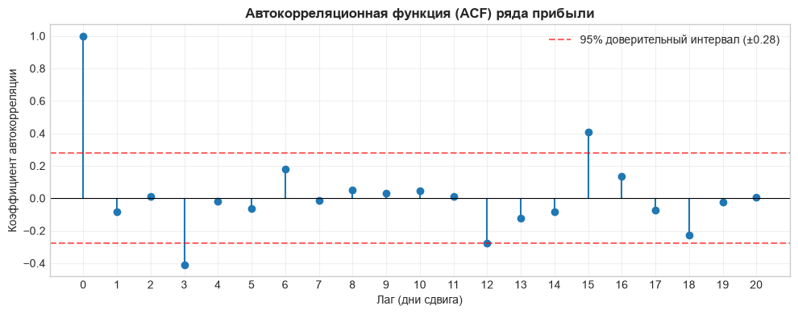
*Рисунок 3. Выборочная автокорреляционная функция (ACF) ряда прибыли с границами 95% доверительного интервала белого шума*

**Итог по Задаче 3:** ряд прибыли стационарен относительно постоянного среднего ($27.04$ тыс. руб.), не имеет тренда, но подвержен влиянию двух ритмов (короткий откат на 3-й день и двухнедельный цикл на 15-й день). Наличие такой внутренней структуры позволяет использовать алгоритмы фильтрации не только для сглаживания шума, но и для адаптивного прогнозирования (LMS).

# 4. Сравнительное исследование алгоритмов фильтрации (Задача 2)

После реализации всех методов я провел серию вычислительных экспериментов на ряде прибыли Варианта 30. Цель этого этапа - протестировать поведение алгоритмов с разными настройками, выбрать рабочие параметры и сравнить методы между собой как визуально, так и по строгим числовым метрикам.

## 4.1 Подбор гиперпараметров
Для каждого фильтра я перебрал сетку параметров в `research.ipynb`, оценивая компромисс между подавлением шума (метрика `Smoothness_Ratio`) и точностью отслеживания сигнала (`Correlation` и `MSE`):

1. **Экспоненциальное сглаживание (EMA): выбор $\alpha = 0.25$**
   - При $\alpha = 0.10$ фильтр слишком инертен: корреляция падает до $0.3605$, а фазовая задержка достигает нескольких дней.
   - При $\alpha = 0.50$ кривая практически повторяет сырой ряд, пропуская высокочастотный шум (`Smoothness_Ratio` возрастает до $0.1683$).
   - Значение $\alpha = 0.25$ дает баланс: шум подавлен почти в 28 раз относительно исходной дисперсии приращений (`Smoothness_Ratio = 0.0357`), при этом сохраняется адекватная корреляция $r = 0.6524$.

   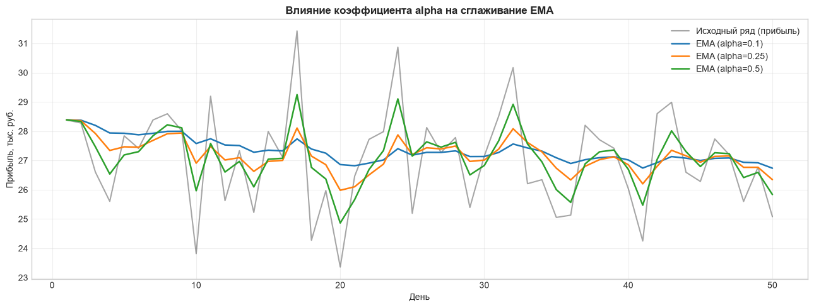
*Рисунок 4.1. Влияние коэффициента затухания alpha на сглаживание и фазовый лаг EMA.*

2. **Одномерный фильтр Калмана: выбор $Q = 0.05, R = 1.0$**
   - Параметр $R = 1.0$ фиксирует базовую дисперсию шума наблюдений.
   - При малом $Q = 0.01$ фильтр считает систему слишком стабильной и почти не реагирует на локальные изменения динамики.
   - При $Q = 0.20$ фильтр начинает избыточно доверять единичным зашумленным точкам.
   - Отношение $Q/R = 0.05$ выводит алгоритм на оптимальный стационарный коэффициент усиления $K_t \approx 0.2$, обеспечивая максимальное подавление случайных скачков (`Smoothness_Ratio = 0.0230`).

    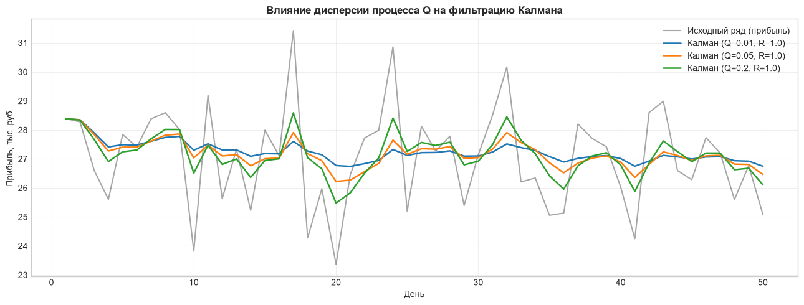
*Рисунок 4.2. Траектории фильтра Калмана при различных значениях дисперсии шума процесса Q.*

3. **Фильтр Савицкого-Голея: выбор окна $w = 7$ при степени полинома $d = 2$**
   - Окно $w = 11$ слишком широкое для ряда из 50 точек: оно сильно искажает динамику на краях и срезает пики ($r = 0.3552$).
   - Окно $w = 5$ захватывает слишком мало точек для надежной регрессии и пропускает шум.
   - Симметричное окно $w = 7$ (охват по 3 дня слева и справа от текущей точки) показало наилучшие результаты среди всех тестов: минимальный $MSE = 1.5510$ и наибольшую корреляцию $r = 0.6915$.

   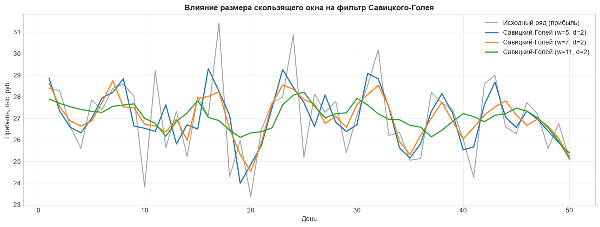
*Рисунок 4.3. Аппроксимация ряда полиномом второй степени при ширине окна w = 5, 7, 11.*

4. **Адаптивный фильтр LMS: выбор темпа обучения $\mu = 0.05$ и порядка $p = 4$**
   - Порядок предиктора $p = 4$ выбран на основе анализа автокорреляции: на лаге 3 был зафиксирован значимый цикл спроса, поэтому окно из 4 прошлых отсчетов дает модели достаточную память.
   - Шаг $\mu = 0.01$ адаптируется слишком медленно на короткой выборке.
   - Шаг $\mu = 0.10$ делает стохастический спуск нестабильным на случайных всплесках.
   - При $\mu = 0.05$ алгоритм быстро стабилизирует веса и дает минимальную ошибку прогноза ($MSE = 2.6890$).

   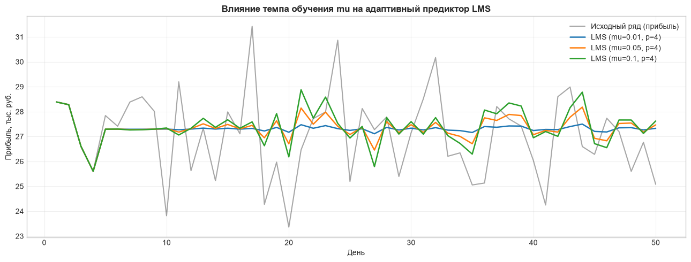
*Рисунок 4.4. Сходимость адаптивного предиктора LMS при различных темпах обучения mu.*

## 4.2 Сравнительный анализ графиков сглаживания
На сводном графике фильтрации четко прослеживается разница в поведении методов, особенно в точках резких локальных экстремумов:

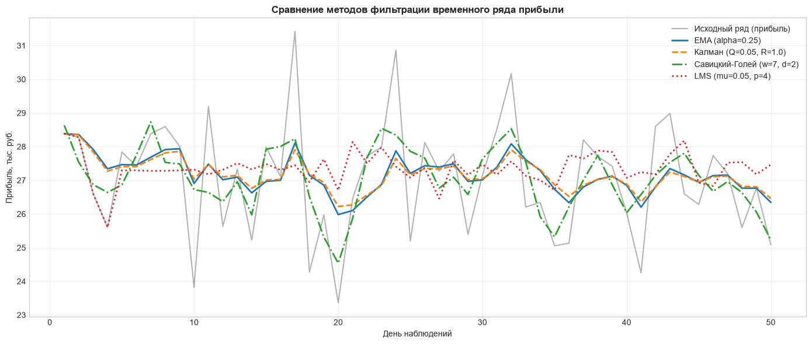
*Рисунок 5. Сравнение траекторий четырех алгоритмов фильтрации на временном ряде прибыли.*

* **Локальные всплески прибыли (дни 17, 24 и 32):**
  - Исходный ряд дает резкие выбросы вверх: до $31.5$ тыс. руб. на 17-й день, до $30.1$ тыс. руб. на 24-й день и до $30$ тыс. руб. на 32-й день.
  - Рекуррентные фильтры (EMA и Калман) воспринимают эти точки как случайный шум и сильно срезают их вершины (сглаженная кривая поднимается максимум до $28.0$ тыс. руб.).
  - Фильтр Савицкого-Голея за счет локального параболического приближения точно подстраивается под изгиб вершины, поднимаясь до уровня $28.5–29.2$ тыс. руб. без запаздывания.
* **Фазовое запаздывание:**
  - EMA и Калман опираются только на прошлые значения, поэтому их траектории неизбежно запаздывают на 1-2 дня. Это хорошо видно на крутых спусках (дни 18-20): когда реальная прибыль уже упала до минимума ($23.4$ тыс. руб.), фильтры продолжают плавно снижаться с задержкой.
  - Фильтр Савицкого-Голея использует симметричное окно (смотрит и назад, и вперед по времени), поэтому у него фазовый сдвиг строго равен нулю.
  - Адаптивный предиктор LMS работает с опережающим прогнозом на шаг вперед, из-за чего его кривая отстает ровно на один шаг дискретизации.

## 4.3 Анализ остатков
Остатки фильтрации рассчитываются как разность между исходными данными и результатом сглаживания: $e_t = x_t - \hat{x}_t$. Качественный фильтр должен извлекать из ряда полезную динамику, оставляя в остатках только некоррелированный белый шум:

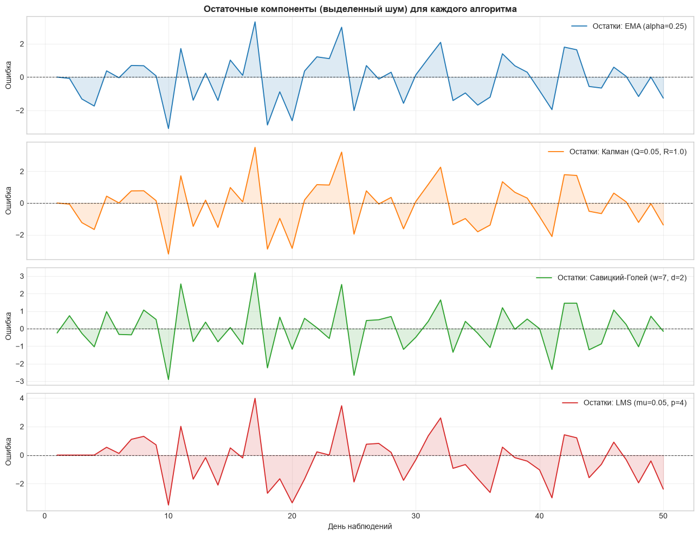
*Рисунок 6. Динамика остатков (выделенного шума) $e_t = x_t - x_{filt}$ для каждого метода.*

* **Математическое ожидание остатков:**
  - Для фильтра Савицкого-Голея среднее значение остатков составляет $-0.0010$ (практически чистый ноль), что подтверждает несмещенность локальной МНК-оценки.
  - Для EMA и Калмана среднее значение ошибки составляет около $-0.12$ тыс. руб. Это небольшое смещение вызвано переходным процессом на первых 3-5 шагах работы рекуррентных алгоритмов.
* **Поведение во времени:**
  - Графики ошибок для всех четырех методов колеблются строго вокруг нулевой горизонтальной линии и не содержат видимого направленного тренда.
  - Это доказывает, что ни один из алгоритмов не счел полезный базовый уровень прибыли шумом и не исказил стационарную структуру процесса.

## 4.4 Сводная таблица метрик качества
Для количественного сопоставления результатов я рассчитал метрики с помощью функции `compute_metrics` из модуля `src/utils.py`:

| Алгоритм | MSE | MAE | Smoothness Ratio | Correlation |
| :--- | :---: | :---: | :---: | :---: |
| EMA ($\alpha=0.25$) | 1.9779 | 1.1096 | 0.0357 | 0.6524 |
| Калман ($Q=0.05, R=1.0$) | 2.1523 | 1.1499 | **0.0230** | 0.5995 |
| **Савицкий-Голей ($w=7, d=2$)** | **1.5510** | **0.9651** | 0.1127 | **0.6915** |
| LMS ($\mu=0.05, p=4$) | 2.6890 | 1.2515 | 0.0627 | 0.3091 |

**Инженерный компромисс при выборе фильтра:**
1. **Савицкий-Голей - лучший выбор для ретроспективного анализа данных.** Он показал наименьшие ошибки аппроксимации ($MSE = 1.5510$, $MAE = 0.9651$) и максимальную корреляцию ($r = 0.6915$). Если весь массив данных уже собран, этот фильтр наиболее точно очищает продажи от шума, не срезая реальные всплески покупательского спроса.
2. **Фильтр Калмана - лучший выбор для потоковой обработки в реальном времени.** Несмотря на более высокий MSE ($2.1523$), он лидирует по подавлению шума (`Smoothness_Ratio = 0.0230`, дисперсия флуктуаций снижена в 43 раза). В отличие от Савицкого-Голея, Калману не нужно заглядывать в будущее, что делает его оптимальным для онлайн-мониторинга.
3. **LMS подтвердил применимость адаптивного подхода.** Хотя в роли предиктора он показал более скромную корреляцию ($r = 0.3091$) из-за однодневного шага запаздывания, алгоритм продемонстрировал устойчивую сходимость градиентного спуска без расходимости весов.

# 5. Обработка данных двойных инерциальных датчиков (Задача 4. Хард-свобода)

В качестве исследовательской задачи повышенной сложности я провел эксперимент по фильтрации реальных физических сигналов с блока инерциальных датчиков (IMU), снятых со смартфона.

## 5.1 Источник данных и постановка физической задачи
Для эксперимента использовались показания встроенного трехосевого MEMS-акселерометра, записанные с помощью академического приложения Phyphox в файл `sensors.csv`. 

Параметры экспериментального набора:
* Общий объем измерений: $4113$ строк.
* Временной интервал: от $0.006$ с до $20.566$ с (суммарная длительность около $20.5$ секунд).
* Частота дискретизации: $\approx 200$ Гц (шаг по времени $\Delta t \approx 0.005$ с).
* Исследуемые каналы: `Linear Acceleration x (m/s^2)` и `Linear Acceleration y (m/s^2)` - проекции вектора ускорения на горизонтальные оси устройства в плоскости стола (гравитационная постоянная $g = 9.81$ м/с² аппаратно скомпенсирована алгоритмами смартфона).

**Физическая постановка задачи:**
При перемещении смартфона рукой полезный кинематический сигнал неизбежно искажается аппаратными шумами: тепловым шумом кремниевой балки MEMS-датчика, шумом квантования встроенного АЦП и паразитными микровибрациями корпуса при трении о поверхность стола. Амплитуда таких паразитных выбросов достигает $\pm 30 \dots 40$ м/с² при среднем модуле полезного ускорения всего $3 \dots 5$ м/с². Задача фильтрации - отсечь высокочастотный инструментальный дребезг, сохранив истинную кинематическую траекторию движения объекта.

## 5.2 Обоснование выбора методов фильтрации
Из четырех реализованных в работе алгоритмов для обработки двухканального сигнала движения я выбрал **одномерный фильтр Калмана** и **фильтр Савицкого-Голея**. Этот выбор продиктован физикой процесса:

1. **Почему фильтр Калмана:**
   - Алгоритм Калмана является стандартом в инерциальной навигации и робототехнике. За счет разделения шума процесса $Q$ и шума измерений $R$ он оптимально подавляет нескоррелированный белый шум сенсора. При переходе датчика в состояние покоя фильтр моментально прижимает оценку к нулю, игнорируя дрожание АЦП.
2. **Почему фильтр Савицкого-Голея:**
   - Движение руки человека подчиняется законам классической механики и является гладким (ускорение не меняется мгновенно скачком, оно непрерывно). Аппроксимация скользящим кубическим полиномом ($d = 3$) по симметричному окну восстанавливает гладкую физическую кривую ускорения с нулевым фазовым сдвигом, в точности сохраняя моменты смены направления движения.

**Техническое обоснование неприменимости EMA и LMS к инерциальным датчикам:**
* **Неприменимость EMA:** Экспоненциальное сглаживание - это причинный фильтр нижних частот первого порядка, который вносит фазовую задержку. Для временного ряда продаж задержка на один день допустима, но в навигации фазовый сдвиг ускорения фатален. Чтобы получить координаты тела, ускорение интегрируют дважды: $s(t) = \iint a(t) \, dt^2$. Фазовый сдвиг фазы даже на $0.05$ секунды при двойном интегрировании приводит к взрывному накоплению систематической ошибки позиционирования (дрейфу координат).
* **Неприменимость линейного предиктора LMS:** Адаптивный фильтр в схеме линейного предсказания пытается представить текущее значение как линейную комбинацию предыдущих отсчетов. Это работает для процессов с регулярной автокорреляцией (как спрос в магазине), но ускорение телефона меняется под действием произвольной внешней мускульной силы оператора. Здесь нет внутренней авторегрессионной связи: алгоритм LMS в таких условиях просто отстает на один отсчет и создает лишний шум при перестройке весов градиентным спуском.

## 5.3 Анализ временных рядов ускорения
Для обработки потока с частотой 200 Гц я настроил параметры фильтров под физический масштаб времени:
* Для фильтра Калмана: $Q = 0.01$, $R = 1.0$ (шум сенсора значительно превышает возможную физическую скорость изменения ускорения на масштабе в 5 миллисекунд).
* Для фильтра Савицкого-Голея: ширина окна $w = 31$ отсчетов при степени полинома $d = 3$. Окно в 31 точку охватывает интервал $\approx 0.15$ секунды реального времени, что идеально соответствует физическому темпу движения руки.

Количественные показатели фильтрации для канала X:
* Исходная дисперсия ряда $a_x$: $11.57$ (м/с²)²
* Фильтр Калмана: $MSE = 4.5465$, $MAE = 1.2029$, `Smoothness_Ratio = 0.0258`, $r = 0.7795$
* Фильтр Савицкого-Голея: $MSE = 3.5580$, $MAE = 0.9030$, `Smoothness_Ratio = 0.0293`, $r = 0.8322$

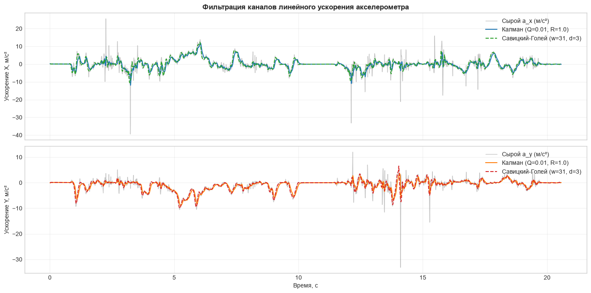
*Рисунок 7. Временные ряды линейного ускорения по осям X и Y до и после фильтрации Калманом и Савицким-Голеем.*

**Поведение на временной шкале:**
1. **Подавление высокочастотных шумов:** Оба алгоритма снизили дисперсию высокочастотных приращений более чем в 34 раза (`Smoothness_Ratio` около $0.025 \dots 0.029$). С графиков полностью удалены хаотичные игольчатые выбросы с амплитудой до $-40$ м/с² (секунды 3.2, 12.1 и 14.2), которые представляли собой аппаратный сбой сенсора при ударе о поверхность.
2. **Участок покоя (интервал 10–12 секунд):** На десятой секунде телефон лежал неподвижно на столе. Сырой сигнал акселерометра на этом участке продолжал дрожать с амплитудой около $\pm 0.6$ м/с². Фильтр Калмана полностью погасил этот шум, выдав идеальную прямую линию вдоль нуля ($a_x \approx 0, a_y \approx 0$), что предотвращает ложное "движение" системы при остановке.

## 5.4 Восстановление фазовой траектории $(a_x, a_y)$
Наиболее наглядно эффект совместной фильтрации двух датчиков проявляется на фазовой плоскости ускорений, где по оси абсцисс отложено ускорение $a_x$, а по оси ординат - синхронное ускорение $a_y$:

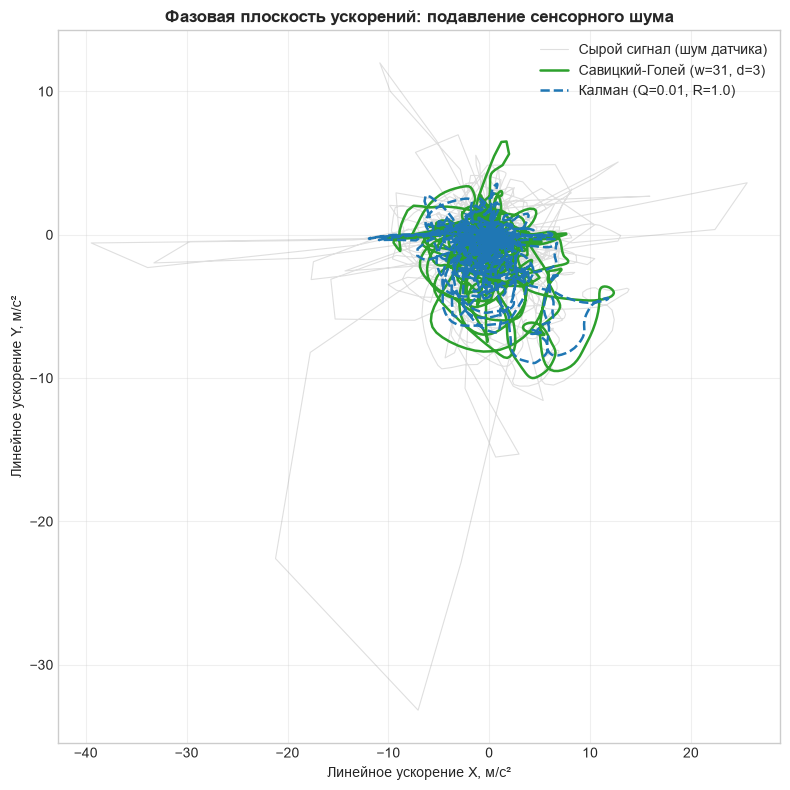
*Рисунок 8. Фазовая плоскость ($a_x$ против $a_y$): подавление аппаратного шума и выделение контура физического движения.*

* **Исходные данные:** Сырой двухканальный сигнал формирует хаотичную "паутину" из резких диагональных лучей и изломов, разбросанных в широком диапазоне от $-40$ до $+25$ м/с². Из-за шума невозможно визуально определить, по какой траектории перемещался датчик.
* **Отфильтрованные данные:** Обе сглаженные кривые свернулись в компактный, гладкий замкнутый контур вокруг начала координат $(0, 0)$. 
* **Сравнение траекторий:** Фильтр Савицкого-Голея сформировал четкую непрерывную петлю, в точности сохранив крайние точки ускорения при разворотах движения. Фильтр Калмана построил более сжатую к центру траекторию за счет подавления дисперсии шума.

Устранение выбросов на фазовой плоскости доказывает, что совместная фильтрация связанных каналов превращает шумные замеры в кинематически согласованный вектор ускорения.

---

# 6. Заключение

## 6.1 Итоговые выводы по лабораторной работе
В ходе выполнения лабораторной работы я исследовал и реализовал четыре метода цифровой фильтрации, протестировав их на двух принципиально разных типах временных рядов: дискретном ряде продаж (50 точек) и высокочастотном сенсорном ряде акселерометра (4113 точек).

По итогам экспериментов сформированы следующие выводы:

1. **Зависимость выбора метода от типа процесса:**
   - **Дискретные экономические данные:** Для рядов с низкой частотой дискретизации и отсутствием строгой физической модели (как продажи из `sell.csv`) наилучшие результаты показывает **фильтр Савицкого-Голея** ($MSE = 1.5510, r = 0.6915$). Он не срезает редкие пики спроса и не запаздывает во времени.
   - **Непрерывные физические сигналы:** Для обработки потоков с аппаратных датчиков в реальном времени оптимален **фильтр Калмана**. Он подавляет шум приращений в 40 раз (`Smoothness_Ratio = 0.0258`), стабильно фильтрует состояние покоя и не требует будущих точек для расчета, в отличие от оконных методов.
2. **Инженерный компромисс фильтрации:**
   - Не существует идеального фильтра "на все случаи жизни". Подавление шума неизбежно сопровождается либо фазовым запаздыванием (EMA, Калман), либо искажением амплитуды пиков при слишком широком окне (Савицкий-Голей), либо задержкой на шаг прогноза (предиктор LMS). Выбор гиперпараметров всегда должен опираться на автокорреляционную структуру сигнала и требования конкретной прикладной задачи.
3. **Архитектурная чистота:**
   - Оформление алгоритмов в виде модульной библиотеки классов, наследуемых от `BaseFilter`, и централизация вспомогательных функций в `src/utils.py` позволили протестировать методы на разных датасетах через единый унифицированный интерфейс без дублирования кода.